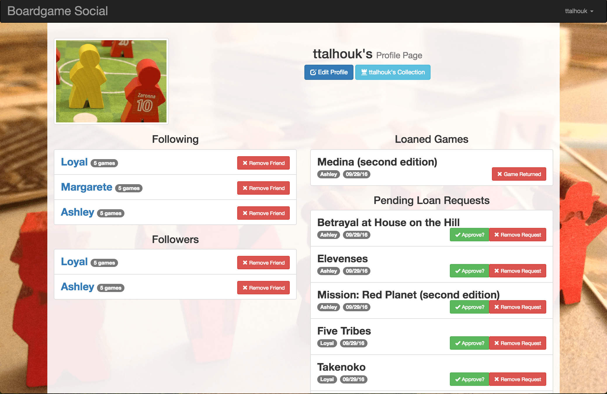
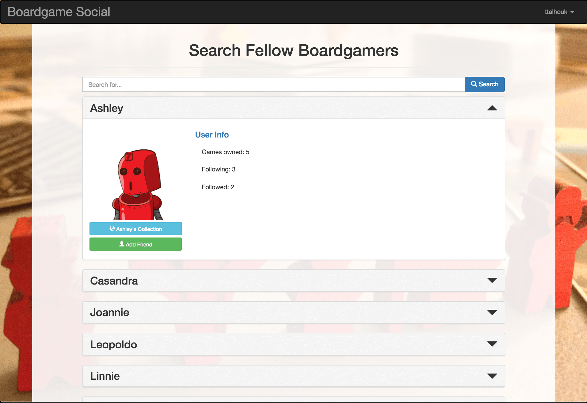
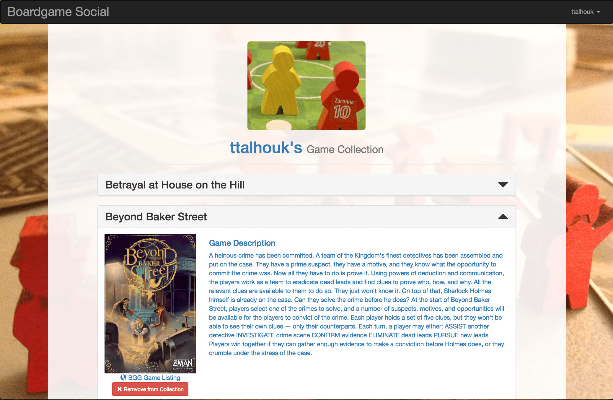
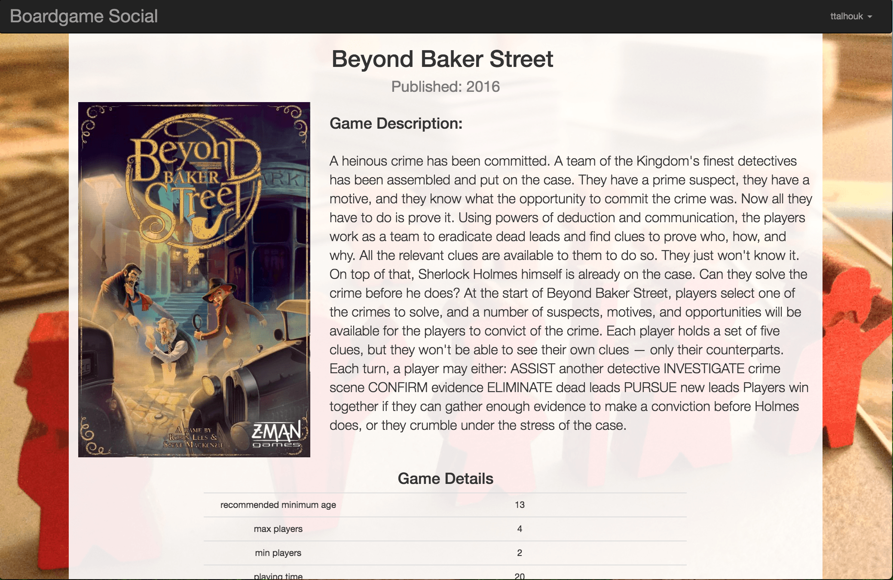

# Boardgame-Social
Rails app to track your boardgames, play sessions with friends

## Features

* Add user
* Able to pull collection from Board Game Geek account through API if username is same as BGG account
* View collection and BGG info for each game
* Able to search users to add as friends
* Able to see friends collection
* Able to request and confirm loaning/borrowing Games

*in progress*

* Able to set up a game with friends

## Using The App

Once logged in users can go to their profile page.

This displays who they are following, who is following them and any of the games from their collection that have borrow requests or that they are borrowing, and any active borrow requests.



Also a user can search the BGG database for a game by going to the search page in the nav bar and entering a search query which will bring up any matching results which they can manually add to their collection.

Also from the dropdown list under their user name they can access a search for other users.



from there they can see that user's info and friend them or see their game collection.

On the user collection screen a list of the games they have are listed.  If they are mutual friends they can request borrowing a game in their list.



If it is their collection scrolling down to the bottom of the page they can sync their collection to their Boardgame Geek account

[BGG](https://www.boardgamegeek.com "boardgamegeek Website")

From the collection screen they can also click on the description to get more details on the game itself.



## Starting the App locally

Fork and Clone repo and navigate to the folder.

Get required gems `> bundle install`

Set up Database
```
> rake db:create
> rake db:migrate
```

Start server `rails s`

Go to `localhost:3000` in your browser

## Contributing

If you would like to contribute submit a pull request and I'll add you as a contributor

## Contributors

ttalhouk

Thanks to Boardgame Geek for supplying boardgame information
